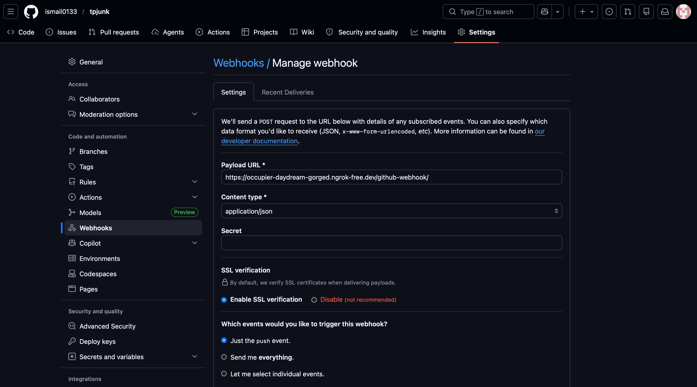
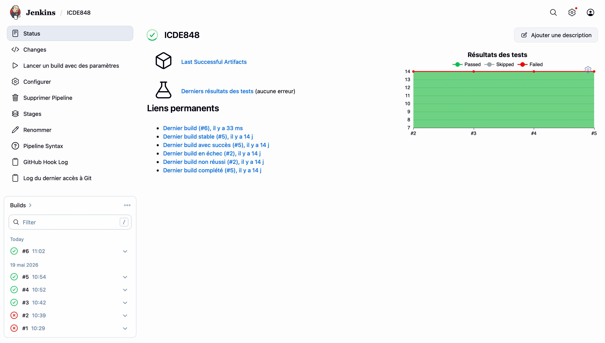
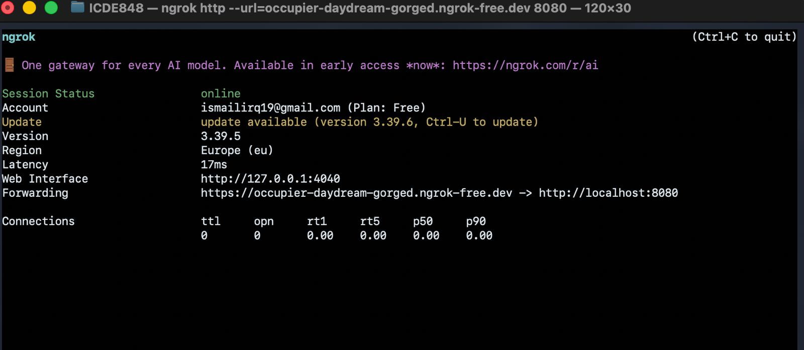
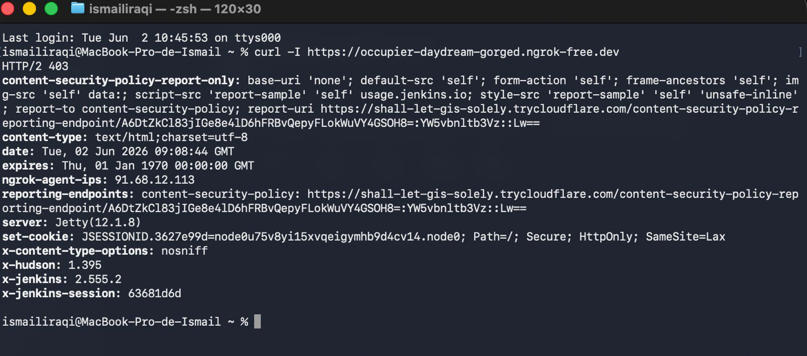

# Rapport TP ICDE848 - Tests, métriques et Jenkins

## Synthèse

J'ai réalisé la mise en place complète de la chaîne d'intégration continue du projet `tp-jenkins`. J'ai réalisé les tests unitaires avec JUnit 5, les tests d'intégration avec Failsafe, la couverture avec JaCoCo, les analyses qualité avec Checkstyle, PMD, CPD et SpotBugs, puis la publication des rapports dans le `Jenkinsfile`.

## Tests automatisés

J'ai réalisé 14 tests unitaires dans `CommandeServiceTest.java`. Ces tests couvrent le calcul du total, l'application des remises, les erreurs attendues et les valeurs frontières des catégories `PETITE`, `MOYENNE` et `GRANDE`.

J'ai réalisé 3 tests d'intégration dans `CommandeServiceIT.java`. Ces tests vérifient des scénarios bout en bout : création d'un panier, calcul du total, application d'une remise et catégorisation finale.

Commande locale utilisée pour les tests :

```bash
mvn clean verify
```

Résultat attendu :

```text
Tests run: 14, Failures: 0, Errors: 0, Skipped: 0
Tests run: 3, Failures: 0, Errors: 0, Skipped: 0
BUILD SUCCESS
```

Commande locale utilisée pour le TP complet :

```bash
mvn clean verify checkstyle:checkstyle pmd:pmd pmd:cpd spotbugs:spotbugs
```

## Couverture JaCoCo

J'ai réalisé la configuration JaCoCo dans `pom.xml` avec un seuil minimum de 70 % sur les lignes couvertes. Le rapport est généré dans `target/site/jacoco/index.html` et le fichier d'exécution dans `target/jacoco.exec`.

J'ai ajouté des tests sur les valeurs frontières `50` et `200`, ainsi qu'une remise de `100 %`, pour améliorer la couverture des branches importantes.

## Analyse qualité

J'ai réalisé la configuration des outils qualité suivants :

| Outil | Rapport |
|---|---|
| Checkstyle | `target/checkstyle-result.xml` |
| PMD | `target/pmd.xml` |
| CPD | `target/cpd.xml` |
| SpotBugs | `target/spotbugsXml.xml` |

J'ai identifié et corrigé des violations qualité :

| Outil | Règle | Correction réalisée |
|---|---|---|
| Checkstyle | `NeedBraces` | J'ai ajouté les accolades dans `categoriserCommande`. |
| Checkstyle | `LeftCurly` | J'ai mis les getters de `Article` sur plusieurs lignes. |
| SpotBugs | `EI_EXPOSE_REP` | J'ai corrigé `Panier.getArticles()` pour retourner une vue non modifiable. |

## Pipeline Jenkins

J'ai réalisé un `Jenkinsfile` avec les stages demandés : `Checkout`, `Build`, `Tests unitaires`, `Tests intégration`, `Couverture JaCoCo`, `Qualité` et `Archive`.

J'ai réalisé la publication Jenkins des rapports :

| Rapport Jenkins | Configuration |
|---|---|
| Tests JUnit | `junit '**/target/surefire-reports/*.xml'` et `junit '**/target/failsafe-reports/*.xml'` |
| Couverture JaCoCo | `jacoco(...)` avec seuil ligne à 70 % |
| Analyse qualité | `recordIssues(...)` pour Checkstyle, PMD, CPD et SpotBugs |

Le pipeline contient aussi les paramètres `ENVIRONMENT`, `BRANCH` et `SKIP_TESTS`, ainsi que les notifications email en cas d'échec et quand le build redevient stable.

J'ai réalisé la configuration du job Jenkins `ICDE848` pour utiliser le dépôt GitHub `https://github.com/ismail0133/tpjunk.git` et déclencher le pipeline à chaque push GitHub.

## Liaison GitHub, ngrok et Jenkins

J'ai ajouté le déclencheur `githubPush()` dans le `Jenkinsfile` afin que le pipeline Jenkins puisse être lancé automatiquement par un webhook GitHub.

J'ai réalisé l'automatisation ngrok avec trois scripts :

| Script | Rôle |
|---|---|
| `scripts/install-ngrok.sh` | Vérifie l'installation de ngrok, l'installe avec Homebrew si nécessaire et valide la configuration. |
| `scripts/start-ngrok-jenkins.sh` | Lance un tunnel ngrok vers Jenkins local sur le port `8080`, récupère l'URL publique et affiche l'URL du webhook GitHub. |
| `scripts/configure-github-webhook.sh` | Configure le webhook GitHub automatiquement si GitHub CLI est installé et connecté, sinon affiche les étapes manuelles. |

Commandes utilisées pour la liaison :

```bash
./scripts/install-ngrok.sh
# Si un token ngrok est demandé :
NGROK_AUTHTOKEN=ton_token ./scripts/install-ngrok.sh
./scripts/start-ngrok-jenkins.sh
./scripts/configure-github-webhook.sh
```

L'URL à renseigner dans GitHub est générée automatiquement au format :

```text
https://xxxx.ngrok-free.app/github-webhook/
```

Cette configuration permet à GitHub d'envoyer l'événement `push` vers Jenkins, même si Jenkins est lancé en local.

## Captures Jenkins

J'ai configuré le webhook GitHub avec l'URL ngrok publique de Jenkins. La capture ci-dessous montre le `Payload URL` renseigné avec `/github-webhook/`, le type `application/json` et l'événement `push`.



J'ai réalisé un build Jenkins déclenché automatiquement depuis GitHub. La capture ci-dessous montre le job `ICDE848` en succès, avec un nouveau build `#6` lancé après le push.



J'ai réalisé la vérification locale de Jenkins avec ngrok. La capture ci-dessous montre le tunnel actif vers `http://localhost:8080`.



J'ai vérifié depuis le terminal que l'URL publique ngrok répond bien avec Jenkins. La réponse contient `x-jenkins: 2.555.2`, ce qui confirme que la liaison publique atteint Jenkins.



## Build en échec puis correction

J'ai observé un échec local avec SpotBugs parce que Maven utilisait Java 25. Le message important était :

```text
Unsupported class file major version 69
```

J'ai corrigé la configuration Maven en ciblant explicitement Java 17 avec `maven.compiler.release` et en mettant à jour le plugin SpotBugs. Cette correction correspond mieux au TP, car Jenkins doit utiliser l'outil `JDK17`.
